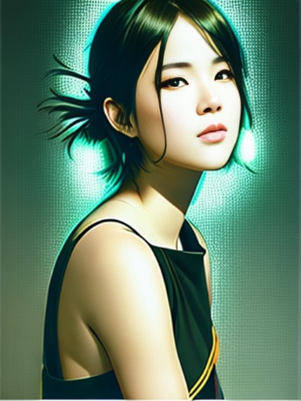

# Phodal 的 AI 研究（18 禁）

PS：本文的图形部分因 “真实世界原因”，包含一些年龄受限的词汇，不建议未成年人阅读。

现在，我并不擅长 AI，所以很多 AI 领域相关的词汇，我是不擅长的，只为自己总结一下。

总体来说，**AI 相当于美国队长的实力，遇强则强，遇弱则弱**，关键其实在于 Prompt。

## 图形生成：如何描述一张照片？？

开始之前，我们需要思考一个问题：如何描述一张照片？

我们脑海中的场景：

接着，用文本来抽象它。在这里，我结合一下 Stable Diffusion 来讲述一下过程。

### 文本描述：第一个示例

生成 prompt：

- phodal: 我想写一段话描述一张照片，帮我美化一下：一年轻女子穿着裙子，背对着镜头，在海边看着日落，太阳已经到地平线下面了，她的头发在风中飘动。
- ChatGPT: 这张照片中的场景令人心醉，一位年轻女子穿着一条裙子，站在海边，背对着镜头，凝视着地平线下的夕阳。太阳已经沉入了海面，一片金黄色的光芒在海面上弥漫，照亮了整片海洋，仿佛这个时刻被定格在了时间的某个角落里。女子的头发随着微风轻轻飘动，轮廓被余晖映照得柔和而温暖。她的目光凝视着远方，仿佛在思考着生命的意义和无尽的未来。这张照片中蕴含着一种深刻的内涵，让人感受到时间和自然的力量，也让人思考着自己在这个宏大而美丽的世界中的角色和意义。 

如果转换成英语的话：

> A young woman wearing a flowing dress stands at the edge of the sea, her back turned to the camera as she gazes upon
> the glow of the setting sun. The ocean stretches out before her in all its grandeur, and the sun slowly sinks below
> the horizon, casting a golden light over the water. The woman's hair sways gently in the breeze, her features softened 
> by the warm hues of the sunset. Her gaze is fixed on the distance, as if pondering the meaning of life and the endless 
> possibilities of the future.

重复了 N 次之后，你会得到你想要的成功的照片，当然也会有失败的出现：

但是，熟悉各种搜索引擎的关键词的或者 NLP 的你，肯定知道，上面的大部分可能是废话，可以减化为如下的词，并添加一些专用的模型词汇，如`black hair`, `hand before body`, `no hand`, `bodycon dress`：

> women back view without face, flowing dress, edge of the sea, backview, back turned to the camera, upon the glow of the setting sun, sun below the horizon, golden light over the water, hair sways gently, Chinese style clothes, black hair,

随后，添加一些反向 prompt，意思是不要这些内容，诸如于 AI 不擅长的：`bad hands`、`morbid` 等等。随后，不断调整 prompt，比如生成更好的 Prompt：

<table>
  <tr>
    <td></td>
    <td></td>
    <td></td>
    <td></td>
   </tr> 
</table>

诸如于采用 [Magic Prompt](https://huggingface.co/spaces/Gustavosta/MagicPrompt-Stable-Diffusion)。

### 加个 Pose：结合 ControlNet

再使用上面的代码作为示例：

配合一下参数调整（俗称炼丹）：

<table>
  <tr>
    <td></td>
    <td></td>
    <td></td>
    <td></td>
   </tr> 
   <tr>
    <td></td>
    <td></td>
    <td></td>
    <td></td>
  </tr>
</table>

### 更多的模型集：与二次元世界的照片（18 禁）

众所周知，AI 的生成质量是与模型息息相关的，所以好的质量需要有好的模型。

我们可以在 [https://civitai.com/](https://civitai.com/) 上找到更多的模型，不过因为年龄限制等原因，只建议你在安全的场所打开，不建议在公共场所打开。

用以下的提示词来介绍模型的质量：里面可能包含一些不适词语，为了体现真实世界，这里并不打算屏蔽。

提示词 ：

> modelshoot style, (wavy blue hair), ((half body portrait)), ((showing boobs, giant boobs, humongous breasts)), ((
> beautiful light makeup female sorceress in majestic blue dress)), photo realistic game cg, 8k, epic, (blue diamond
> necklace hyper intricate fine detail), symetrical features, joyful, majestic oil painting by Mikhail Vrubel, Atey
> Ghailan, by Jeremy Mann, Greg Manchess, WLOP, Charlie Bowater, trending on ArtStation, trending on CGSociety, Intricate,
> High Detail, Sharp focus, dramatic, photorealistic, black background, epic volumetric lighting, fine details,
> illustration, (masterpiece, best quality, highres), standing in majestic castle

负面提示词

> (((simple background))),monochrome ,lowres, bad anatomy, bad hands, text, error, missing fingers, extra digit, fewer
> digits, cropped, worst quality, low quality, normal quality, jpeg artifacts, signature, watermark, username, blurry,
> lowres, bad anatomy, bad hands, text, error, extra digit, fewer digits, cropped, worst quality, low quality, normal
> quality, jpeg artifacts, signature, watermark, username, blurry, ugly,pregnant,vore,duplicate,morbid,mut ilated,tran
> nsexual, hermaphrodite,long neck,mutated hands,poorly drawn hands,poorly drawn face,mutation,deformed,blurry,bad
> anatomy,bad proportions,malformed limbs,extra limbs,cloned face,disfigured,gross proportions, (((missing arms))),(((
> missing legs))), (((extra arms))),(((extra legs))),pubic hair, plump,bad legs,error legs,username,blurry,bad feet,
> lowres, bad anatomy, bad hands, text, error, missing fingers, extra digit, fewer digits, cropped, worst quality, low
> quality, normal quality, jpeg artifacts, signature, watermark, username, blurry

### 小结

现在，让我们来思考一下，如何描述：好的描述 + 好的姿势 + 好的模型 + 好的参数。

## 内容生成：ChatGPT

phodal：我想写一篇文章，主题是《如何用 ChatGPT 写一篇文章，以如何用 ChatGPT 写一篇文章 》

示例：

### 领域驱动的 ChatGPT

内容基于：[DDD 概念参考](https://domain-driven-design.org/zh/ddd-concept-reference.html)

### 上下文

上下文：

- 提供上
- 主题聚焦：
- 构建相关性：

明确的 prompt：

1. 用 100 字介绍一下 ChatGPT
2. 以 Julia 作为可以以具体的案例为例，介绍如何使用 ChatGPT 写一篇博客大赛的参赛作品。这包括如何确定主题、如何撰写开头和结尾、如何组织文章结构等等。主题是：《Julia Dataframe 在大数据分析领域的使用》，大纲中包含：用 200 字介绍一下 Julia 语言历史；介绍如何使用 DataFrames.jl，并有个代码示例；对比一下 Python Pandas、Apache Spark Dataframe；小结。
3. 对本文的内容进行总结，并再次强调使用 ChatGPT 进行写作的好处以及参加博客大赛的重要性。

### 框架（frameworks）

简单的反馈回路：

## 代码生成：GitHub Copliot

注释生成：

### 代码生成开源模型

Saleforce
数据模型：[https://huggingface.co/Salesforce/codegen-6B-mono](https://huggingface.co/Salesforce/codegen-6B-mono)

## 其它：Macbook Pro 的吐槽

公司配置的 Macbook Pro 2019 虽然有 AMD 显卡，但是没有 CUDA、ROCm 的支持，所以只能用 CPU 来跑了。

### AI 生态不友好

诸如于 PyTorch，以前是支持 ROCm 加速的：

现在的版本不行了：https://pytorch.org/get-started/locally/ 。

## 相关资源

[Awesome Prompt Engineering](https://github.com/promptslab/Awesome-Prompt-Engineering)

### 本文相关资源

AI 生成图片：

- Stable Diffusion Webui GitHub： https://github.com/AUTOMATIC1111/stable-diffusion-webui
- 通用的 AI 模型社区：https://huggingface.co/
- Stable Diffusion AI 艺术模型社区：https://civitai.com/ （18 禁）

代码模型相关：

- Salesforce 模型：https://huggingface.co/Salesforce/codegen-6B-mono
- CarpserAI： https://huggingface.co/CarperAI/diff-codegen-6b-v2

ControlNet 加强：

- 模型：https://huggingface.co/lllyasviel/ControlNet
- 预编译：https://huggingface.co/kohya-ss/ControlNet-diff-modules
