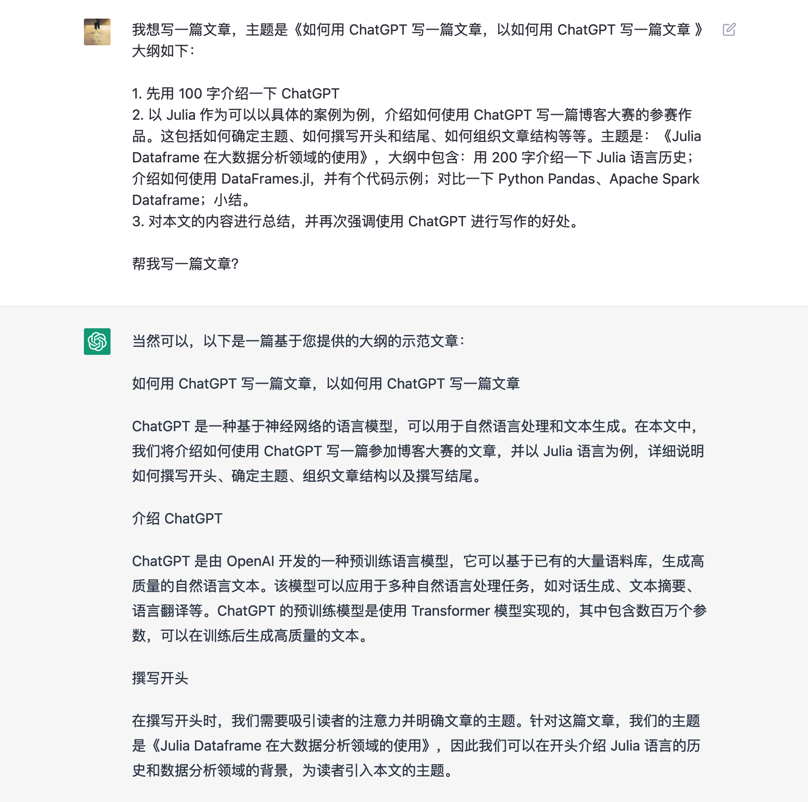
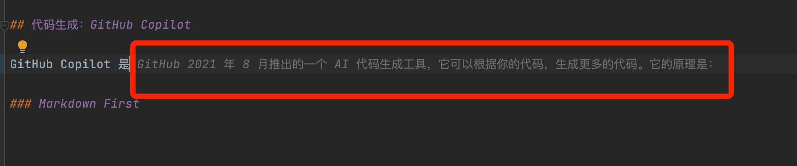
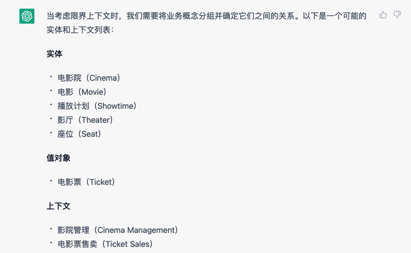
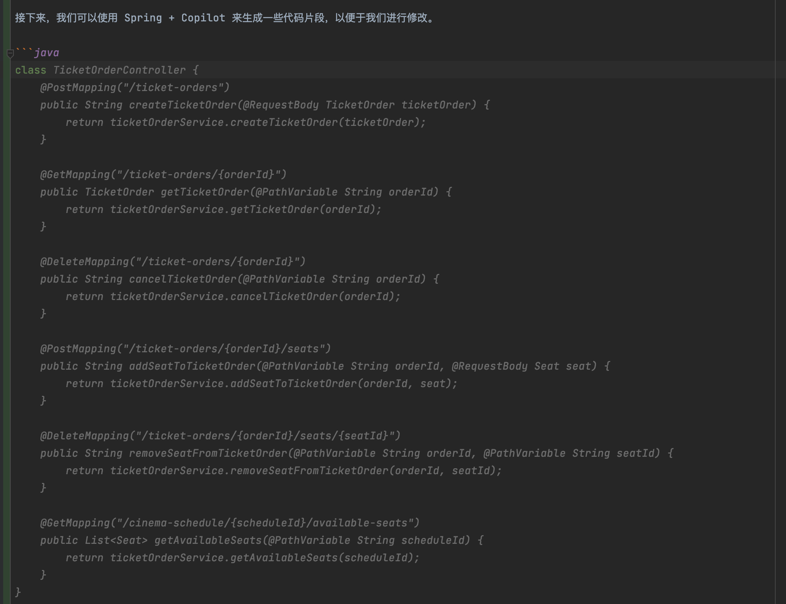
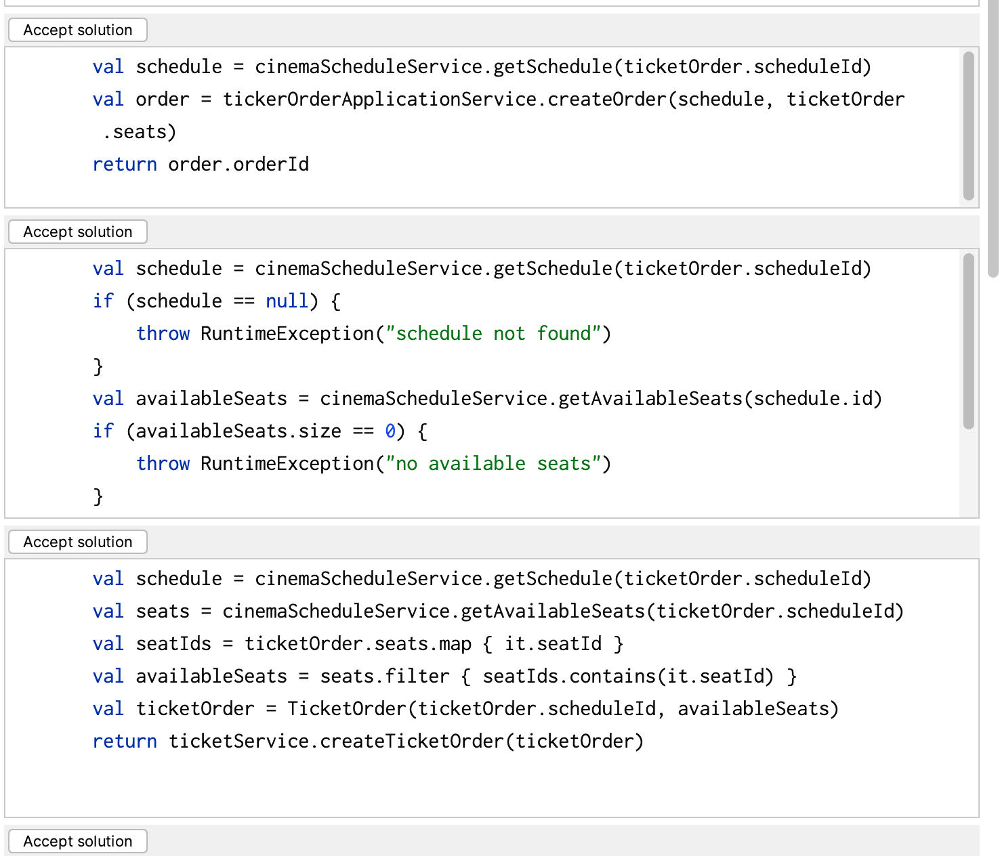
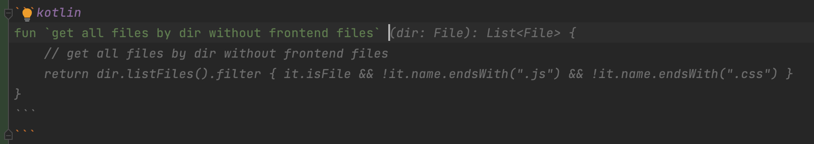

# 基于编程、绘画、写作的 AI 探索与总结

目录介绍

- Stable Diffusion 简易教程：[Stable Diffusion](./stable-diffusion)
- 从 AI 绘画看 AIGC 的未来
- Jupyter 练习 AI 相关部分
    - [translate.ipynb](./translate.ipynb) 中文翻译英文
    - [codeai.ipynb](./codeai.ipynb) 代码自动生成

# 基于编程、绘画、写作的 AI 探索与总结：理解 Prompt

PS：本文的图形部分因 “真实世界原因”，包含一些年龄受限的词汇，建议未成年人在监护人陪同下阅读。

就当前节点（2023.02.22）而言，我虽然研究过一段时间传统的机器学习，但是并不擅长深度学习等领域，所以很多 AI 领域相关的词汇，我是不擅长的，只为自己总结一下，方便在未来更新自己的认识。

内容主要是结合我过去擅长的编程、写作、绘画展开的：

1. 绘画：text 2 image。结合 Stable Diffusion 讲述一张图片的演化。
2. 写作：chat 2 article。结合 ChatGPT 讲述围绕特定主题的内容创作。
3. 编程：comment 2 code。结合 GitHub Copilot 如何加速日常的编程活动。

总体来说，**AI 相当于美国队长的实力，遇强则强，遇弱则弱**，关键其实在于 Prompt。所以，如何更好地完善 prompt，实现 prompt 工程就是：如何更好地使用 AI 的基础。

> Prompt 是一种文本输入方式，用于与自然语言处理模型（例如GPT）进行交互。Prompt 是一个短语或一句话，可以启动模型并产生与 Prompt 相关的输出。这个输出可以是一个单独的单词、一句话，或者是一段完整的段落。它可以控制模型的行为，使其产生特定的结果。

所以，如何更好地完善 prompt，实现 prompt 工程就是：如何更好地使用 AI 的基础。所以，在这篇文章里，我将介绍：

1. 用 text 2 image 来展示如何演进 prompt
2. 用 text 2 article 来展示充足 prompt 的优点
3. 结合 GitHub Copliot 来实现 prompt 完成工作

PS：感谢我老婆提供的照片。

## 图形生成：如何描述一张照片？？

人类需要思考第一个问题：如何描述一张照片？在不关心感受的情况下，我们关注于主体、背景、颜色、构图等。

现在，我们脑海中出现一个场景：


接着，用文本来抽象它。在这里，我结合一下 Stable Diffusion 来讲述一下过程。

### 文本描述：第一个示例

生成 prompt：

- phodal: 我想写一段话描述一张照片，帮我美化一下：一年轻女子穿着裙子，背对着镜头，在海边看着日落，太阳已经到地平线下面了，她的头发在风中飘动。
- ChatGPT: 这张照片中的场景令人心醉，一位年轻女子穿着一条裙子，站在海边，背对着镜头，凝视着地平线下的夕阳。太阳已经沉入了海面，一片金黄色的光芒在海面上弥漫，照亮了整片海洋，仿佛这个时刻被定格在了时间的某个角落里。女子的头发随着微风轻轻飘动，轮廓被余晖映照得柔和而温暖。她的目光凝视着远方，仿佛在思考着生命的意义和无尽的未来。这张照片中蕴含着一种深刻的内涵，让人感受到时间和自然的力量，也让人思考着自己在这个宏大而美丽的世界中的角色和意义。 

如果转换成英语的话：

> A young woman wearing a flowing dress stands at the edge of the sea, her back turned to the camera as she gazes upon
> the glow of the setting sun. The ocean stretches out before her in all its grandeur, and the sun slowly sinks below
> the horizon, casting a golden light over the water. The woman's hair sways gently in the breeze, her features softened 
> by the warm hues of the sunset. Her gaze is fixed on the distance, as if pondering the meaning of life and the endless 
> possibilities of the future.

重复了 N 次之后，你会得到你想要的成功的照片，当然也会有失败的出现（因为没有配置 negative prompt 过滤失败的情况）：


但是，熟悉各种搜索引擎的关键词的或者 NLP 的你，肯定知道，上面的大部分可能是废话，可以减化为如下的词，并添加一些专用的模型词汇，如`black hair`, `hand before body`, `no hand`, `bodycon dress`：

> women back view without face, flowing dress, edge of the sea, backview, back turned to the camera, upon the glow of the setting sun, sun below the horizon, golden light over the water, hair sways gently, Chinese style clothes, black hair,

随后，添加一些反向 prompt，意思是不要这些内容，诸如于 AI 不擅长的：`bad hands`、`morbid` 等等。随后，不断调整 prompt，比如生成更好的 Prompt：

<table>
  <tr>
    <td></td>
    <td></td>
    <td></td>
   </tr> 
</table>


诸如于采用 [Magic Prompt](https://huggingface.co/spaces/Gustavosta/MagicPrompt-Stable-Diffusion)。

### 精准控图：结合 ControlNet

由于生成的姿势是随机的、无法控制，所以我就引入了 ControlNet 插件 ——用来实现骨骼绑定、精准控线、线稿上色、依据深度图结构透视精准重绘等。现在，就能结合我们做的创作来完善生成的图形，诸如于我们绘制草图、或者输入一张原始图片，就可以生成我们预期的效果：

最后，生成的图片如下：


在我写完文章的时候，又修改了一下 prompt：

> women back view without face standing on the sandy beach, bodycov full skirt, edge of the sea,  back turned to the camera, upon the glow of the setting sun, black hair, sunset red to blue gradient sky

对应的 negative prompt 是：


> (((simple background))),monochrome ,lowres, bad anatomy, bad hands, text, error, missing fingers, extra digit, fewer digits, cropped, worst quality, low quality, normal quality, jpeg artifacts, signature, watermark, username, blurry, lowres, bad anatomy, bad hands, text, error, extra digit, fewer digits, cropped, worst quality, low quality, normal quality, jpeg artifacts, signature, watermark, username, blurry, ugly,pregnant,vore,duplicate,morbid,mut ilated,tran nsexual, hermaphrodite,long neck,mutated hands,poorly drawn hands,poorly drawn face,mutation,deformed,blurry,bad anatomy,bad proportions,malformed limbs,extra limbs,cloned face,disfigured,gross proportions, (((missing arms))),(((missing legs))), (((extra arms))),(((extra legs))),pubic hair, plump,bad legs,error legs,username,blurry,bad feet

效果凑合着，还是不错的。然后，我们可以做更多的尝试，配合一下参数调整（俗称炼丹）：

<table>
  <tr>
    <td></td>
    <td></td>
    <td></td>
   </tr> 
   <tr>
    <td></td>
    <td></td>
    <td></td>
  </tr>
</table>

也可以结合 inpaint 对失真的部分进行修复。

### 更多的模型集：与二次元世界的照片（18 禁）

众所周知，AI 的生成质量是与模型息息相关的，所以好的质量需要有好的模型。

我们可以在 [https://civitai.com/](https://civitai.com/) 上找到更多的模型，不过因为年龄限制等原因，只建议你在安全的场所打开，不建议在公共场所打开。

真实的人物由于版权的种种原因，所以这个软件在二次元世界相当的流行。如下是常见的提示词来描述模型的质量，里面可能包含一些不适词语，为了体现真实世界，这里并不打算屏蔽。

提示词 ：

> modelshoot style, (wavy blue hair), ((half body portrait)), ((showing boobs, giant boobs, humongous breasts)), ((
> beautiful light makeup female sorceress in majestic blue dress)), photo realistic game cg, 8k, epic, (blue diamond
> necklace hyper intricate fine detail), symetrical features, joyful, majestic oil painting by Mikhail Vrubel, Atey
> Ghailan, by Jeremy Mann, Greg Manchess, WLOP, Charlie Bowater, trending on ArtStation, trending on CGSociety, Intricate,
> High Detail, Sharp focus, dramatic, photorealistic, black background, epic volumetric lighting, fine details,
> illustration, (masterpiece, best quality, highres), standing in majestic castle

负面提示词

> (((simple background))),monochrome ,lowres, bad anatomy, bad hands, text, error, missing fingers, extra digit, fewer
> digits, cropped, worst quality, low quality, normal quality, jpeg artifacts, signature, watermark, username, blurry,
> lowres, bad anatomy, bad hands, text, error, extra digit, fewer digits, cropped, worst quality, low quality, normal
> quality, jpeg artifacts, signature, watermark, username, blurry, ugly,pregnant,vore,duplicate,morbid,mut ilated,tran
> nsexual, hermaphrodite,long neck,mutated hands,poorly drawn hands,poorly drawn face,mutation,deformed,blurry,bad
> anatomy,bad proportions,malformed limbs,extra limbs,cloned face,disfigured,gross proportions, (((missing arms))),(((
> missing legs))), (((extra arms))),(((extra legs))),pubic hair, plump,bad legs,error legs,username,blurry,bad feet,
> lowres, bad anatomy, bad hands, text, error, missing fingers, extra digit, fewer digits, cropped, worst quality, low
> quality, normal quality, jpeg artifacts, signature, watermark, username, blurry

足够丰富的描述，可以帮助 AI 理解描述我们的需求：


上图为 AI 生成，也是同样场景下，不屏蔽的结果 —— 其原因是大部分的模型库加入了很多 18 禁的内容。

### 小结

现在，让我们来思考一下，如何描述一张带人物的图片：

- 详细的描述词。
- 人物的姿势。
- 丰富的模型。
- 反复修改的参数。
- 持续迭代。（基于 InPaint 等进行修改）

那么，文章呢？

## 文章：如何围绕特定主题思考？

结合一下先前 Stable Diffusion 的无数次的失败经验，我们应该先找好一个合适的框架来跑 ChatGPT。

在编写内容的内容，我们会有各种思路和原则：STAR、金字塔原理、5W1H等等。

我们可以以 STAR （Situation（情景）Task（任务）、Action（行动）和 Result（结果））可以作为与 ChatGPT 会话的基础：

1. 描述一个情境或背景，使读者对问题有更好的了解。
2. 说明任务或目标，告诉读者需要完成什么。
3. 描述你所采取的行动，例如使用什么方法、工具、策略等等。
4. 解释结果，包括遇到的挑战和取得的成果。

这样，对于我们展开思路会有一些帮助。

### 情境：如何用 ChatGPT 写一篇文章，以如何用 ChatGPT 写一篇文章?

phodal：我想写一篇文章，主题是《如何用 ChatGPT 写一篇文章，以如何用 ChatGPT 写一篇文章 》

示例：


但是，这样的内容并非我们想要的。

而在这个标题里，其实 ChatGPT 已经理解了，如何写一篇文章，换作是一个冷门的话题，他就不知道了。在此时，我们需要构建一个更丰富的上下文：


在这时，ChatGPT 给出的步骤依旧是错的，我们需要继续纠正。所以，我们可以考虑在一开始给一个完整的上下文：

### 构建更完整的上下文

对于 ChatGPT 来说，我们需要明确的 prompt：：

```

我想写一篇文章，主题是《如何用 ChatGPT 写一篇文章，以如何用 ChatGPT 写一篇文章》，文章的大纲是：

1. 先用 100 字介绍一下 ChatGPT
2. 以 Julia 作为可以以具体的案例为例，介绍如何使用 ChatGPT 写一篇博客大赛的参赛作品。这包括如何确定主题、如何撰写开头和结尾、如何组织文章结构等等。主题是：《Julia Dataframe 在大数据分析领域的使用》，大纲中包含：用 200 字介绍一下 Julia 语言历史；介绍如何使用 DataFrames.jl，并有个代码示例；对比一下 Python Pandas、Apache Spark Dataframe；小结。
3. 对本文的内容进行总结，并再次强调使用 ChatGPT 进行写作的好处。

帮我写一篇文章？
```

如此一来，我们提供的上下文就会更加准确，就可以看到一个范例：



基于这个范例，可以思考我们的内容如何编写。

### 构建框架（frameworks）

ChatGPT 本身构建了一个框架，我们可以再输入一个有用的框架，以构建简单的反馈回路。于是，我开始教他 DDD，然后相互学习：


不过，ChatGPT 和上面的图片一样，经常丢失一些上下文。

phodal: 在这个 TicketOrder 聚合里，他应该包含哪些 API ？

在 TicketOrder 聚合里，可以包含以下一些 API：

1. createOrder()：创建一个新的订单，可以接收顾客信息、场次信息、座位信息等参数，并返回一个唯一的订单号。
2. cancelOrder(orderId)：取消某个订单，需要提供订单号。
3. getOrder(orderId)：获取某个订单的详细信息，需要提供订单号。
4. reserveSeats(showTimeId, seatIds)：在某个场次中预留座位，需要提供场次号和座位号。
5. confirmOrder(orderId)：确认订单，此时座位被锁定并且订单状态被改为已确认。
6. payOrder(orderId, paymentInfo)：支付订单，需要提供订单号和支付信息。
7. refundOrder(orderId)：退票，需要提供订单号并且只能在订单状态为已确认时进行。
8. updateOrder(orderId, updateInfo)：修改订单信息，可以更新顾客信息、场次信息、座位信息等，需要提供订单号和更新内容。

基本的 API 可以满足电影院订票业务的需求，但具体实现还需要根据业务场景和需求进行细化和调整。

### 其它小建议：

相似的，与 Stable Diffusion 类似的是，AI 生成的内容经常出现各种问题，所以我们要注意：

1. 保持自然的表达。ChatGPT 能够生成流畅的语句，但有时可能会出现奇怪或不合适的表达。在使用 ChatGPT 进行写作时，需要注意保持自然的表达方式。
2. 适时修正错误。如果 ChatGPT 生成的内容不准确或有错误，应该及时进行修正，以保证文章的准确性和可读性。
3. 多次修改和调整。ChatGPT 的输出结果虽然会自动进行语法纠错和编辑，但是为了保证文章质量，还是需要经过多次修改和调整，不断完善文章结构和内容。
4. 保持简洁明了。在使用 ChatGPT 进行写作时，需要尽量保持简洁明了，避免使用过于复杂的句式和词汇，以便读者更好地理解文章内容。
5. 注重原创性和独特性。尽管 ChatGPT 能够生成大量的文章，但是为了在博客大赛中脱颖而出，还需要注重文章的原创性和独特性，尽可能地突出自己的风格和思想。

考虑到 ChatGPT 的代码并不那么准确，让我们使用 GitHub Copilot 生成更多的内容。

## 代码生成：GitHub Copilot

GitHub Copilot 是 GitHub 2021 年 8 月推出的一个 AI 代码生成工具，它可以根据你的代码，生成更多的代码。



所以，对于 Markdown 本身来说，它也能提供一些帮助。当然了，在这方向它没有 ChatGPT 那么强大，经常会出现一些奇怪的重复代码。

但是，也并非不可用，我们可以使用它来生成一些代码片段，以便于我们进行修改。

### 完整示例：DDD + ChatGPT + Copilot

如结合 Chat GPT 我们可以完成代码的前置设计（当然有些不靠谱）：



复制生成的 API，写行注释告诉 Copilot：`convert to markdown table`，然后我们就有了：

| API    | 描述             | HTTP方法 | URL                                           | 参数     | 返回值         |
|--------|----------------|--------|-----------------------------------------------|--------|-------------|
| 创建订单   | 创建一个新的订单       | POST   | /ticket-orders                                | 创建订单信息 | 订单ID        |
| 查询订单   | 查询一个已存在的订单     | GET    | /ticket-orders/{orderId}                      | 订单ID   | 订单信息        |
| 取消订单   | 取消一个已存在的订单     | DELETE | /ticket-orders/{orderId}                      | 订单ID   | 取消成功或失败信息   |
| 添加座位   | 向一个已存在的订单添加座位  | POST   | /ticket-orders/{orderId}/seats                | 座位信息   | 座位添加成功或失败信息 |
| 移除座位   | 从一个已存在的订单中移除座位 | DELETE | /ticket-orders/{orderId}/seats/{seatId}       | 座位ID   | 座位移除成功或失败信息 |
| 查询可用座位 | 查询某个场次电影的可用座位  | GET    | /cinema-schedule/{scheduleId}/available-seats | 场次ID   | 可用座位信息      |
                                         
接下来，我们可以使用 Spring + Copilot 来生成一些代码片段，以便于我们进行修改：



在有足够类相关信息的情况下，诸如于，我们提供一个注释：

```kotlin
@PostMapping
fun createTicketOrder(@RequestBody ticketOrder: TicketOrder): String {
    // check the schedule is valid, the seats are available, then create the order

}
```

它生成的代码会更加准确：



而如果我们添加了对应的 Exception 的处理注释：`check the schedule is valid, the seats are available, then create the order, if the schedule is not valid, throw NotScheduleAvailableException`，代码进一步转化为：

```kotlin
@PostMapping
fun createTicketOrder(@RequestBody ticketOrder: TicketOrder): String {
    // check the schedule is valid, the seats are available, then create the order, if the schedule is not valid, throw NotScheduleAvailableException
    // check the schedule is valid
    val schedule = cinemaScheduleService.getSchedule(ticketOrder.scheduleId)
    if (schedule == null) {
        throw NotScheduleAvailableException()
    }
    // check the seats are available
    val availableSeats = cinemaScheduleService.getAvailableSeats(ticketOrder.scheduleId)
    if (!availableSeats.containsAll(ticketOrder.seats)) {
        throw NotSeatAvailableException()
    }
    // create order
    return tickerOrderApplicationService.createOrder(ticketOrder)
}
```

在另外一些场景下，如果你的函数名和参数名都是英文，那么 Copilot 生成的代码也会更加准确：



而在单元测试的场景下，Copilot 更加强大和智能，它能够根据你的测试代码，生成更多的测试代码。

### 其它：代码生成开源模型

我也尝试了下 Saleforce
的代码模型：[https://huggingface.co/Salesforce/codegen-6B-mono](https://huggingface.co/Salesforce/codegen-6B-mono)，但是不能在我的 MBP 上跑上来，有些遗憾。

## 总结：AI 就像占卜

你可能无法预期输出的是啥，总会有各种惊喜。

而其实，与 AI 的 prompt 相似的是：和人类聊天的时候，我们也需要提供足够的上下文。所以，你需要一下 ChatGPT，他并不总是能理解你的上下文。

## 其它：Macbook Pro 的吐槽

公司配置的 Macbook Pro 2019 虽然有 AMD 显卡，但是没有 CUDA、ROCm 的支持，所以只能用 CPU 来跑了。

### AI 生态不友好

诸如于 PyTorch，以前是支持 ROCm 加速的：


现在的版本不行了：https://pytorch.org/get-started/locally/ 。

## 本文相关资源

AI 生成图片：

- Stable Diffusion Webui GitHub： https://github.com/AUTOMATIC1111/stable-diffusion-webui
- 通用的 AI 模型社区：https://huggingface.co/
- Stable Diffusion AI 艺术模型社区：https://civitai.com/ （18 禁）

代码模型相关：

- Salesforce 模型：https://huggingface.co/Salesforce/codegen-6B-mono
- CarpserAI： https://huggingface.co/CarperAI/diff-codegen-6b-v2

ControlNet 加强：

- 模型：https://huggingface.co/lllyasviel/ControlNet
- 预编译：https://huggingface.co/kohya-ss/ControlNet-diff-modules

# 如何更好利用 AIGC？结合 AI 绘画的演进与 ChatGPT 现状。

PS：就本文的结论而言，我相信你已经或多或少的有所体会了。也因此，本文更多的是展现一个思考的过程，而不是一个纯粹的结论。

> AIGC 是什么？它是指通过机器学习、自然语言处理等人工智能技术，让计算机自动生成文字、图像、音频、视频等各种类型的内容。它能够帮助企业和个人降低创作成本、提高生产效率、增强创意输出等。 

开始之前，先说结论：哪怕仅就当前的 AIGC 成熟度，我们都明白：**人类应该去做更高价值的事**，也因此在当前的工作模式上呈现的是，三步区：

- 蓝图设计（人类）。 负责创意性的思考与设计工作，如场景、软件架构等。
- 机械化生成（机器）。将创意借助工具或者人转换为 Prompt，然后交给 AIGC 生成。
- 细节修复（人类）。对于 AIGC 生成不合理、不适宜法律法规等的地方，进行修改。

因此，对于诸多**通用的大众领域**，人类这样的碳基生物而言，如果不能从思维框架来驾驭 AIGC。而对于细分领域来说，只要在足够卷的情况下，AIGC 也会给予我们更多的惊喜。 

所以，本文的第一部分就是从现有的 AI 绘画的变化来看，如何更好的利用 AIGC。而第二部分则是结合 ChatGPT 的现状来看，如何更好的利用 AIGC。

## AI 绘画的演进：精准控线 + 个人模型

注意：请在取得授权的情况下，进行个人模型的练习，避免侵犯个人肖像权。

在先前的两篇文章里，《[基于编程、绘画、写作的 AI 探索与总结](https://github.com/phodal/ai-research/)》，以及《[Prompt 编写模式：如何将思维框架赋予机器](https://github.com/phodal/prompt-patterns)》

### Prompt + Negative Prompt

Negative Prompt 会将模型的目标从一般的高概率生成样本转换为生成与负向提示不匹配的低概率样本，从而迫使模型更加关注图像的细节和特征，提高其生成的图像的质量和逼真度。

### Prompt + Negative Prompt + ControlNet

ControlNet 是一种神经网络结构，旨在通过添加额外条件来控制扩散模型。在特定场景下，ControlNet被用于生成类似建模效果（法线贴图）的中间图和相关的图像。这种技术可以被应用于多个领域，如骨骼绑定、精准控线、线稿上色、深度图结构透视精准重绘等。

### Prompt + Negative Prompt + ControlNet + 个人专属模型

现在，你可以用你的 ”头像“，配合你的姿势，直接生成一个新的图形。

注意：请在取得授权的情况下，进行模型的练习与作品创作。

## 个人 AI 策略：强化构架能力，构建小模型，磨炼技巧性

### 策略 0：拥抱变化

首先，我们要理解 AIGC 真的带来变化。

作为一个知名的开源挖抗人，在我使用 GitHub Copilot 的初期，觉得这 TM（Trademark） 就是一个智障。而我适应了：**如何与智障沟通**之后，我悟了，我才是 ”智障“ —— 只有理解机器的 API 与工作方式，才能利用好机器。

### 策略 1：强化构架能力

强化设计是指通过AI技术释放个人的创造力，帮助个人在设计中实现更高效、更优质的创造成果。这个策略的核心在于使用AIGC工具来自动生成大量的创意元素，例如图像、文字、音频等，从而将创造的效率提高到一个新的水平。同时，这个策略也强调了个人在设计过程中的重要性，因为AI工具无法替代个人的感性思考和直觉。

在实践中，个人可以通过以下方式强化自己的构架能力：

- 持续学习新的设计理念和创意方法，不断拓展自己的知识面和视野。例如，了解一些新兴的设计趋势，学习如何将传统的设计元素与现代的技术手段相结合，从而创造出更有创意和张力的作品。
- 坚持思考和探索，不断挑战自己的思维方式和想象力。通过不断思考和实践，将自己的思维方式和想象力逐渐转化为可操作的设计构架，从而在AIGC工具的帮助下实现更高效的创造。
- 熟练掌握使用 AIGC 工具的方法，尤其是一些高级的特性。例如，对于文本生成任务，可以使用 Negative Prompt 等技巧提高生成的质量；对于图像生成任务，则可以使用 ControlNet 等技术实现更精准的控制。

### 策略 2：构建领域小模型

每个人的知识面是不同的，知识体系也是不同的。因此，我们不能期望一个通用的大模型能够满足所有人的需求。相反，我们应该尝试构建适合自己领域的小模型。通过选择合适的数据集、算法和网络结构，我们可以快速训练出一个专门用于解决自己问题的小型模型。这个模型不需要太复杂，只需要满足自己的需求即可。这样可以提高模型的效率和准确度，并且减少训练时间和计算资源的消耗。

例如，对于一个博客作者来说，可以使用 GPT-3 来帮助自己快速生成博客文章的开头或结尾段落，也可以通过训练自己的小模型，生成符合自己风格的文章内容。对于一名摄影师来说，可以通过构建小模型来辅助自己完成相册的排版、图像剪辑等工作。

### 策略 3：磨炼技巧性

诸如于 GitHub Copilot 可以帮你写代码，但是无法从宏观上理解业务问题、整体性的架构问题，生成的代码只是从局部考虑的。因此，我们需要通过不断地磨炼自己的技能和能力，来提高自己的综合素质和创造力。这包括深入学习 AI 技术，了解其原理和应用，同时也包括提高自己的设计、编程和沟通能力等方面。只有这样，我们才能真正地驾驭 AI 技术，让其成为我们的有力助手。

## 小结


