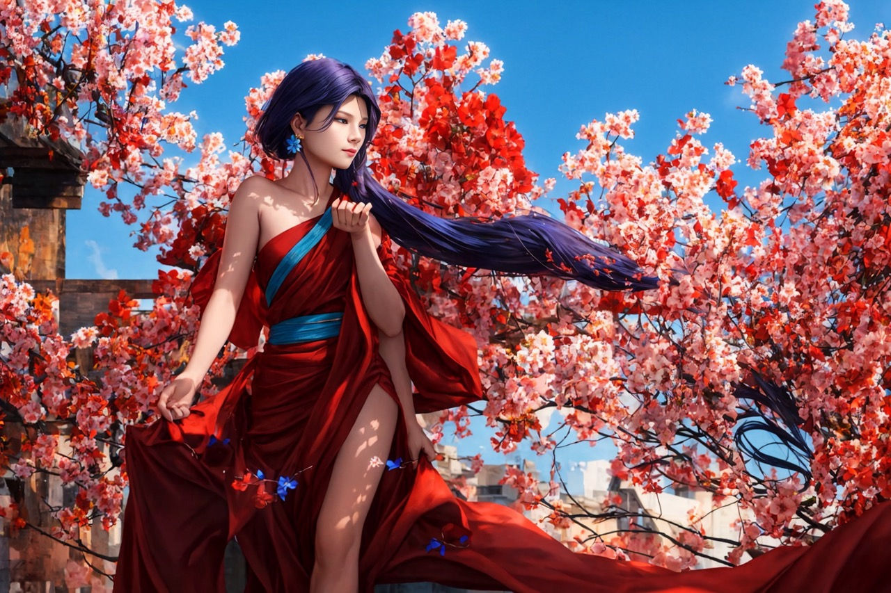
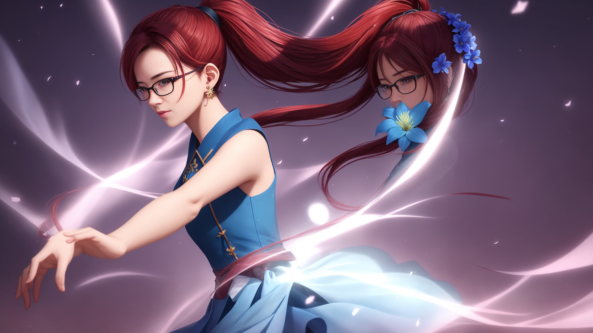

# Stable Diffusion 简易指北

PS：文末有恐怖片，可以滑慢一点。

This is a style guide for the Stable Diffusion project. It is a living document, and will be updated as the project evolves.


## Stable Diffusion 思路

基本思路：Goal -> Style -> ZeroShot/Few Shot -> Negative Prompt

1. Goal：
	- a photo,
	- a painting,
	- a sculpture,
	- a 3D rendering, etc. 
2. Style：诸如于动漫（Anime）、半写实、写实、真人等等
3. 开始模式：ZeroShot/FewShot，以获得更多的灵感
4. 精炼 Prompt
     - 反复尝试 Prompt
     - 添加 Negative Prompt
     - 使用 seed 重新运行 

## 安装

### 本地安装

直接安装 Web UI 界面，详细参见文档：[https://github.com/AUTOMATIC1111/stable-diffusion-webui](https://github.com/AUTOMATIC1111/stable-diffusion-webui) ，对应有文档

推荐插件：

- 精准控线 ControlNet：https://github.com/Mikubill/sd-webui-controlnet
- 国际化 - 中文翻译？
- ……

### AutoDL 云服务

推荐原因：便宜，可以直接用镜像

不推荐原因：容易丢机器（关机就没了）、镜像有时候速度慢

下载数据：官方说：直接从官方下载文档不行，建议使用网盘：[https://www.autodl.com/docs/down/](https://www.autodl.com/docs/down/)。我使用的是新出的阿里云盘，当前还没有限速，上传和下载速度还不错。

Stable Diffiusion WebUI 中文版本：

- AutoDL 镜像：https://www.codewithgpu.com/i/AUTOMATIC1111/stable-diffusion-webui/sd-webui-230220

可用于训练的镜像：

老版本：https://www.codewithgpu.com/i/CrazyBoyM/sd_dreambooth_extension_webui/dreambooth-dreamartist-for-webui


## Google Colab

在线生成 Colab：https://github.com/nolanaatama/sd-1click-colab 

我使用了 Google Colab 训练了第一个版本，毕竟可以免费白嫖。

DreamBooth 训练：

https://colab.research.google.com/github/ShivamShrirao/diffusers/blob/main/examples/dreambooth/DreamBooth_Stable_Diffusion.ipynb

DreamBooth Lora 训练：

https://colab.research.google.com/github/Linaqruf/kohya-trainer/blob/main/kohya-LoRA-dreambooth.ipynb

## Prompt Examples

### FewShot 示例

prompt: solo, 1 gril, young women smell flowers, long skirt,

negative: (pubic hair:2), paintings, sketches, (worst quality:2), (low quality:2), (normal quality:2), lowres, normal quality, ((monochrome:1.5)), ((grayscale)), skin spots, acnes, skin blemishes, age spot, (outdoor:1.6), manboobs, backlight,(ugly:1.331), (duplicate:1.331), (morbid:1.21), (mutilated:1.21), (tranny:1.331), mutated hands, (poorly drawn hands:1.331), blurry, (bad anatomy:1.21), (bad proportions:1.331), extra limbs, (disfigured:1.331), (more than 2 nipples:1.331), (missing arms:1.331), (extra legs:1.331), (fused fingers:1.61051), (too many fingers:1.61051), (unclear eyes:1.331), lowers, bad hands, missing fingers, extra digit, (futa:1.1), logo, white letters,missing fingers, extra digit, fewer digits,(mutated hands and fingers:1.5 ), (long body :1.3),bad hands, fused hand, missing hand, disappearing arms, error, missing fingers, missing limb,fused fingers, one hand with more than 5 fingers, one hand with less than 5 fingers, one hand with morethan 5 digit, one hand with less than 5 digit, extra digit, fewer digits, fused digit, missing digit,text,watermark

## 恐怖片 

### 咒语

参数：

Steps: 30, Sampler: DPM++ SDE Karras, CFG scale: 7, Seed: 4213714763, Size: 512x512, Model hash: 1e46fca6b5, Model: huazhongma_1000


Prompt

```
{{dresses}}, {{masterpiece}}, best quality, illustration, {half body on a girl}, beautiful detailed blue eyes, cinematic lighting, dramatic angle, black and red hair, High ponytail, {beautiful, detailed sky}, { cinematic lighting}, High ponytail hairstyle, blue flower, earring, outdoor, Tresses of silk, in gentle breeze dance from ethereal chance. An aura of peace, in each strand of hair, beyond compare, cinematic lighting, dramatic angle,
```

Negative


```
{{huazhongma}},(huazhongma:1.2),hzm, glasses, {{skirt}}, {{masterpiece}}, best quality, illustration, {full body on a girl}, {solo}, beautiful detailed eyes, cinematic lighting, dramatic angle, black and red hair, High ponytail, {beautiful, detailed sky}, { cinematic lighting}, High ponytail hairstyle, earring, resses of silk, in gentle breeze dance from ethereal chance. An aura of peace, in each strand of hair, cinematic lighting, dramatic angle,
```

结果：

高分辨率（HiRes）修复失败，出现了双胞胎，还挺好玩的：


当然了，还会有，手、手，千手观音：



飞翔的头：




